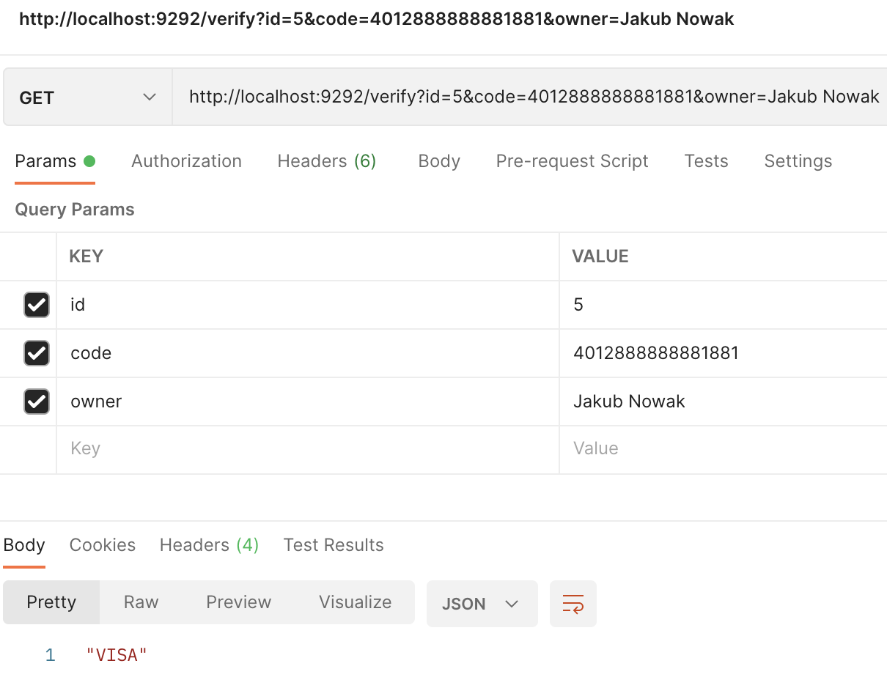
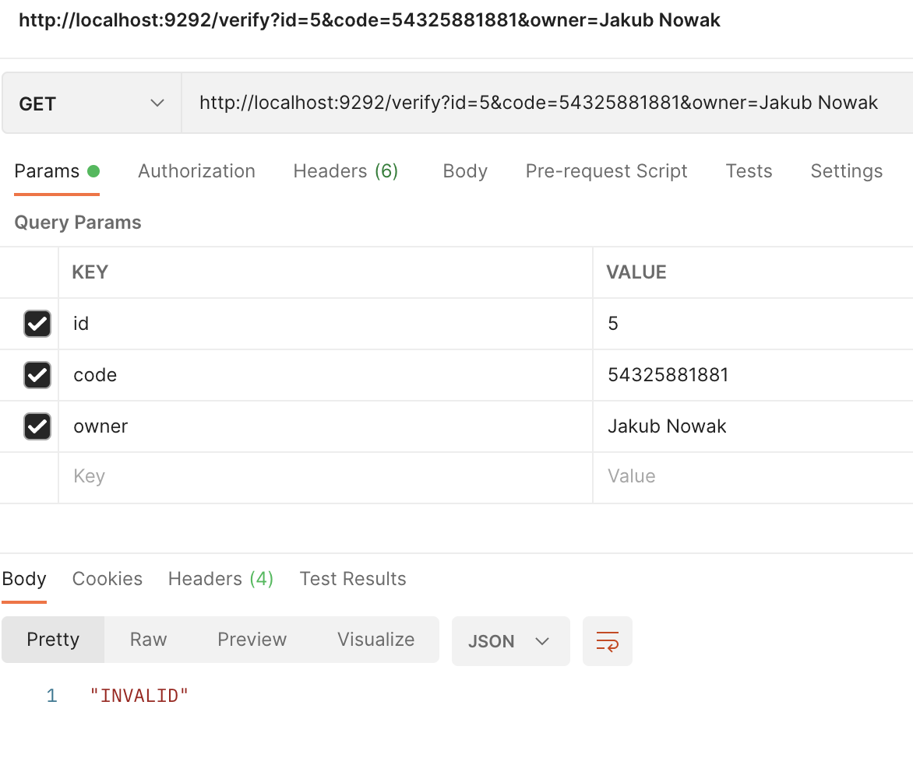
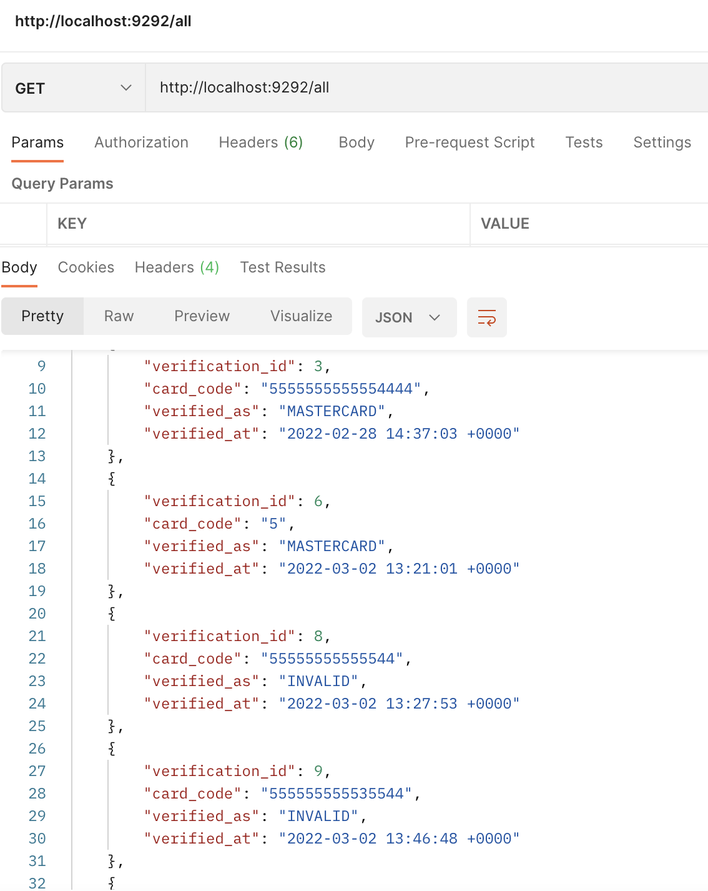

# VERIFICATION API
Simple Grape API that allows verify credit card code using Luhn algorithm.
## Installation:
Run
```
docker-compose up -d
```
Then two services will start:
1. Postgres database for verification logs.
2. Verification API

## Verification
#### Here some correct codes:
1. 378282246310005 AMEX
2. 371449635398431 AMEX
3. 5555555555554444 MASTERCARD
4. 5105105105105100 MASTERCARD
5. 4111111111111111 VISA
6. 4012888888881881 VISA
#### And incorrect:
1. 1234567890 INVALID
2. 3122343433 INVALID
3. ...

Go to postman/web-browser or use curl
#### Verify
```http://localhost:9292/verify?id=<provide_here_any_id>&code=<provide_here_code>&owner=<provide_here_owner>```



#### Get logs
```http://localhost:9292/all```
